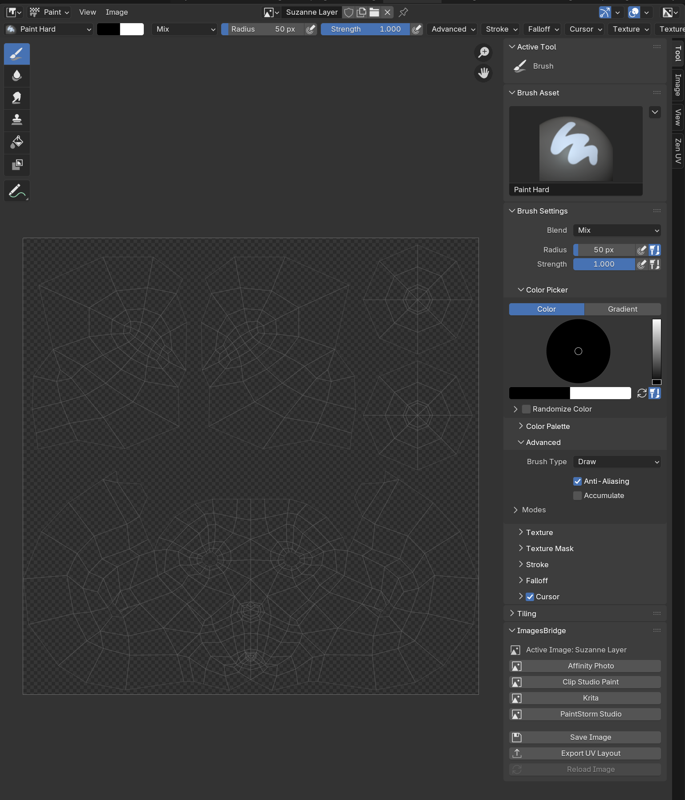
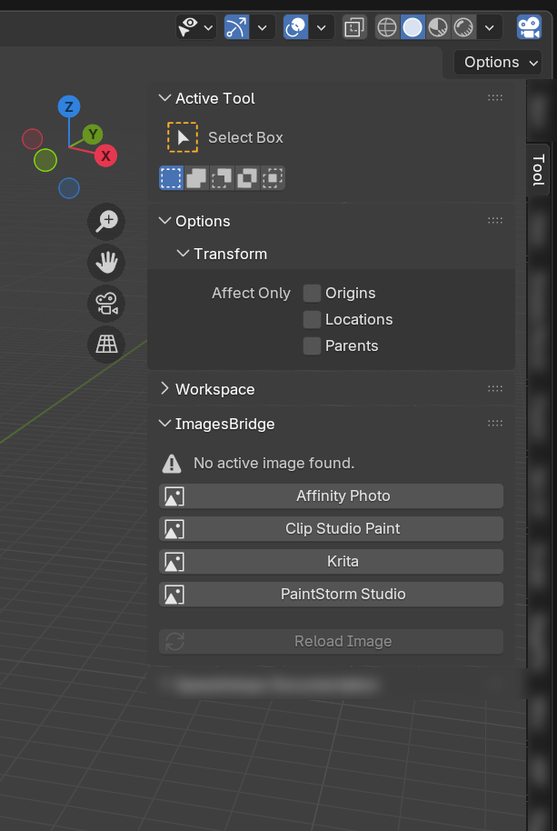
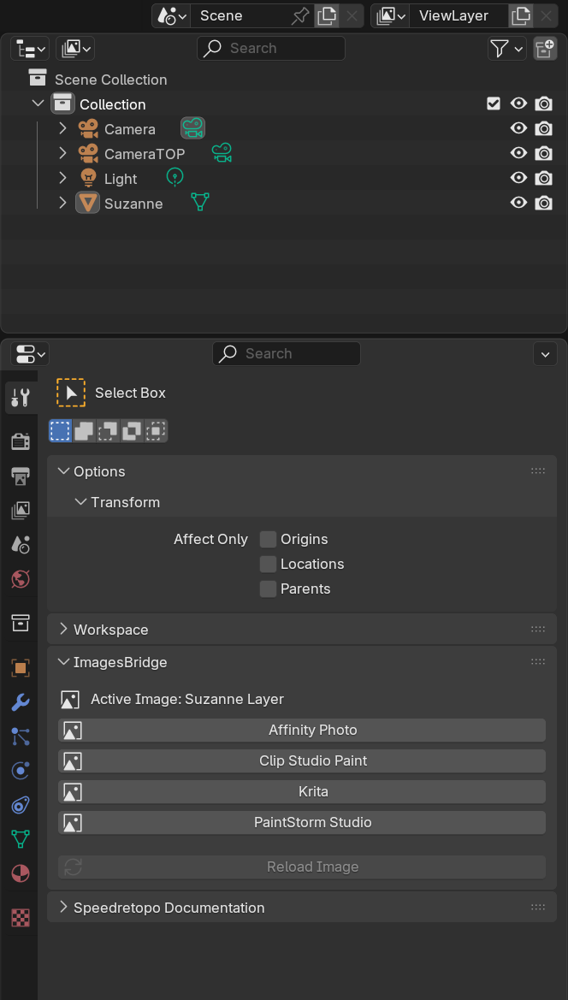
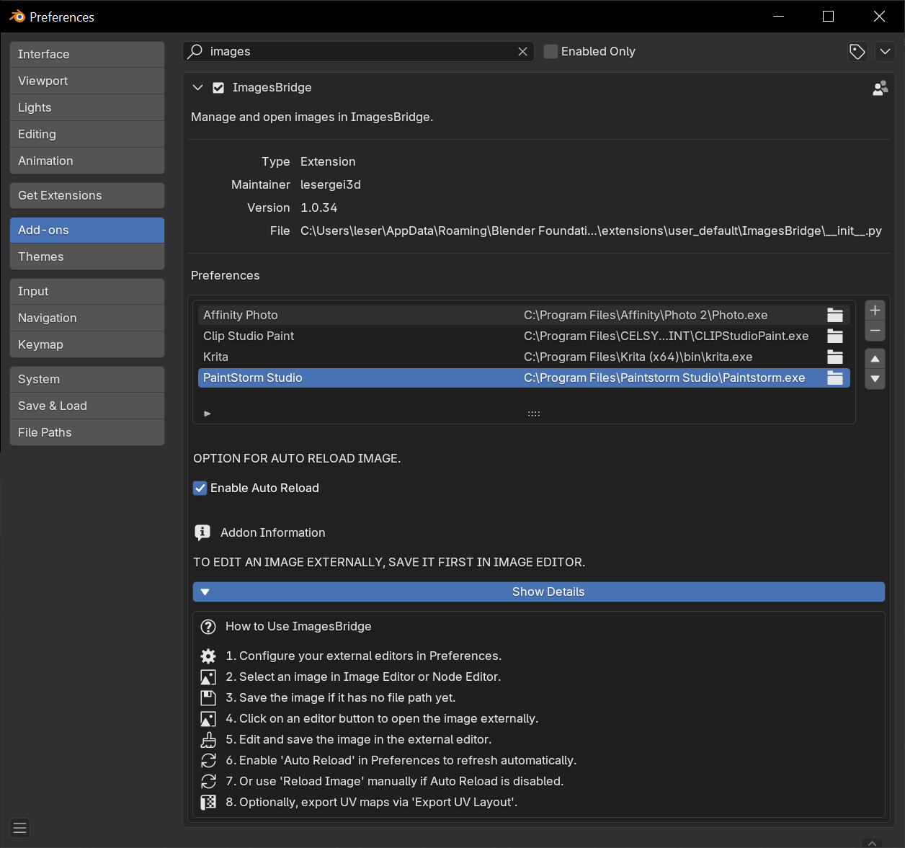

# 🖼️ ImagesBridge – README  
*(French version follows / La version française suit)*  

---

## 📛 Name and Description | Nom et Description  
- **Name / Nom :** ImagesBridge  
- **Description / Description :**  
  - **English:** Allows selecting and opening images in multiple external editors using dedicated buttons.  
  - **Français :** Permet de sélectionner et d’ouvrir des images dans plusieurs éditeurs externes grâce à des boutons dédiés.  

---

## ⚙️ Technical Information | Informations techniques  
- **Blender Version / Version Blender :** Compatible with Blender 4.5.0 and above | Compatible avec Blender 4.5.0 et supérieur  
- **Category / Catégorie :** Image  
- **Version :** 1.0.34  
- **Author / Auteur :** lesergei3d  

---

## 🚀 Addon Features & Functionality | Fonctionnalités principales  

### 1. External Editors Management | Gestion des éditeurs externes  
- **English:** Users can register multiple external editors (e.g., Affinity Photo, GIMP, Krita). Editors can be added, removed, and reordered in the Blender Preferences panel.  
- **Français :** L’utilisateur peut enregistrer plusieurs éditeurs externes (ex. Affinity Photo, GIMP, Krita). Les éditeurs peuvent être ajoutés, supprimés et réorganisés depuis les Préférences de Blender.  

---

### 2. Opening Images in External Editors | Ouverture des images dans des éditeurs externes  
- **English:**  
  - Images must be saved before being opened externally.  
  - If the image has no file path: the addon shows a warning and cancels the operation.  
  - If the image has a path but is not saved (dirty): the user must click **Save Image** before sending it to an external editor.  
  - Once saved, the image opens in the chosen editor.  

- **Français :**  
  - Les images doivent être sauvegardées avant de pouvoir être ouvertes dans un éditeur externe.  
  - Si l’image n’a pas de chemin de fichier : l’addon affiche un avertissement et annule l’opération.  
  - Si l’image a un chemin mais n’est pas enregistrée (modifiée) : l’utilisateur doit cliquer sur **Enregistrer l’image (Save Image)** avant de l’envoyer dans un éditeur externe.  
  - Une fois enregistrée, l’image s’ouvre dans l’éditeur choisi.  

---

### 3. Image Save Workflow | Workflow de sauvegarde  
- **English:** The addon enforces a save-first workflow. A dedicated **Save Image** button is provided to quickly save images before external editing.  
- **Français :** L’addon impose un workflow **“sauvegarder avant d’éditer”**. Un bouton dédié **Enregistrer l’image (Save Image)** est disponible pour simplifier la sauvegarde avant édition externe.  

---

### 4. Custom Operators | Opérateurs personnalisés  
- **English:**  
  - `OpenInExternalEditorOperator`: Opens images in external editors.  
  - `SaveImageOperator`: Ensures images are saved before opening externally.  
  - `ReloadImageOperator`: Reloads modified images from disk into Blender.  
  - `SelectImageNodeOperator`: Helps select image nodes in the Shader Editor.  

- **Français :**  
  - `OpenInExternalEditorOperator` : ouvre les images dans les éditeurs externes.  
  - `SaveImageOperator` : s’assure que l’image est enregistrée avant ouverture externe.  
  - `ReloadImageOperator` : recharge une image modifiée depuis le disque vers Blender.  
  - `SelectImageNodeOperator` : aide à sélectionner les nœuds d’image dans l’Éditeur de shaders.  

---

### 5. UI Integration | Intégration dans l’UI  
- **English:** Buttons to open images are available in:  
  - Image Editor (with a dedicated **Save Image** button).  
  - 3D View (in the Tool panel, when an object has a texture).  
  - Properties Panel (when an image texture is used in a material).  
  - Preferences UI features a **UIList** for managing external editors efficiently.  

- **Français :** Des boutons pour ouvrir les images sont disponibles dans :  
  - Éditeur d’images (avec un bouton dédié **Enregistrer l’image**).  
  - Vue 3D (dans le panneau d’outils, quand un objet possède une texture).  
  - Panneau Propriétés (lorsqu’une texture image est utilisée dans un matériau).  
  - Préférences avec une **UIList** pour gérer efficacement les éditeurs externes.  

---

## 📸 Screenshots / Examples  
*(English + French inline)*  

### 🖼️ Image Editor Integration | Intégration dans l’Éditeur d’images  
- **English:** A **Save Image** button and **Open in External Editor** buttons are added directly inside the Image Editor.  
- **Français :** Un bouton **Save Image** et des boutons **Ouvrir dans un éditeur externe** sont ajoutés directement dans l’Éditeur d’images.  

  

---

### 🎛️ 3D View Integration | Intégration dans la Vue 3D  
- **English:** In the **Tool Shelf (N-Panel)**, under the "ImagesBridge" tab, buttons are available when the active object has a texture.  
- **Français :** Dans la **Vue 3D (panneau N)**, sous l’onglet "ImagesBridge", des boutons apparaissent lorsqu’un objet possède une texture.  

  

---

### ⚙️ Properties Panel Integration | Intégration dans le Panneau Propriétés  
- **English:** In the **Shader Properties** panel, when an image texture is used in a material, extra buttons allow quick access to external editors.  
- **Français :** Dans le **panneau Propriétés du shader**, lorsqu’une texture image est utilisée dans un matériau, des boutons supplémentaires permettent un accès rapide aux éditeurs externes.  

  

---

### 🛠️ Preferences Panel Integration | Intégration dans les Préférences  
- **English:** The Preferences window includes a **UIList** for managing external editors (add, remove, reorder).  
- **Français :** La fenêtre des Préférences inclut une **UIList** pour gérer les éditeurs externes (ajouter, supprimer, réorganiser).  

  

---